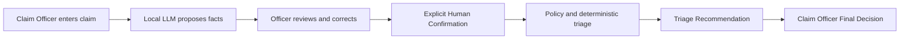
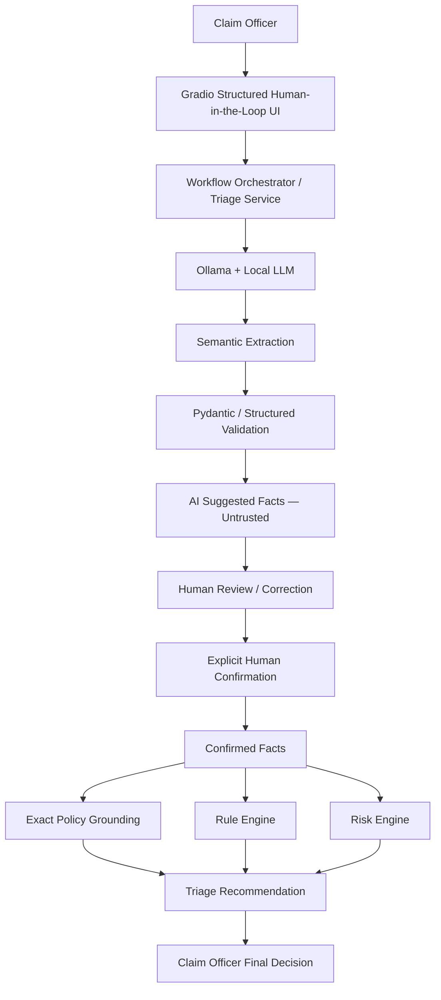
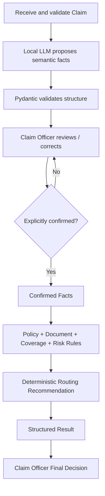

# Motor Insurance Claim Triage Assistant

## AI Solution Design

> เอกสารนี้อธิบาย Business Problem, แนวคิด Hybrid AI, การเลือก Technique,
> Workflow ของ Prototype, Human-in-the-Loop และผลการประเมินระบบ
>
> แนวคิดหลักของ Solution ยังคงเดิม คือใช้ AI ช่วยทำ Initial Claim Triage
> โดยแยกงานด้านภาษาออกจาก Business Logic ที่ต้องให้ผลแน่นอน

---

# 1. Business Problem and Pain Points

## 1.1 Business Background

บริษัทประกันรถยนต์ได้รับ Claim จำนวนมาก Claim Officer ต้องอ่าน Claim Description,
ตรวจเอกสาร, เทียบ Policy, ประเมิน Coverage / Exclusion และสังเกต Risk Signal
ก่อนส่งเคลมไปยังขั้นตอนที่เหมาะสม

เมื่อทำด้วย Manual Process ทั้งหมด จะเกิดปัญหา เช่น

| Business Issue | ผลกระทบ |
|---|---|
| **Manual review effort** | ใช้เวลาอ่านและเปรียบเทียบข้อมูลหลายส่วนด้วยตนเอง |
| **Inconsistent triage** | เจ้าหน้าที่แต่ละคนอาจตีความข้อมูลหรือ Policy ต่างกัน |
| **Missing information** | เอกสารหรือข้อมูลสำคัญอาจถูกพบช้า |
| **Delayed risk detection** | Exclusion หรือ Risk Signal อาจไม่ถูกส่งต่ออย่างรวดเร็ว |
| **Slow response** | ต้องติดต่อลูกค้าหลายรอบและเพิ่ม Cycle Time |

## 1.2 ปัญหาที่ Solution ต้องการแก้

Solution โฟกัส Initial Claim Triage ใน 5 เรื่องหลัก:

1. **Claim Understanding** — เข้าใจ Claim Description และ Claim History ที่เป็น Free Text
2. **Document Checking** — ตรวจเอกสารที่ส่งเทียบกับ Policy
3. **Coverage / Exclusion** — ประเมินเงื่อนไขความคุ้มครองอย่างสม่ำเสมอ
4. **Risk Signal** — แสดงสัญญาณที่ควรตรวจสอบต่อ โดยไม่สรุปว่าเป็น Fraud
5. **Routing Recommendation** — แนะนำ Standard, Manual, Fraud หรือ Rejection Review

AI ไม่ใช่ Final Decision Maker และไม่อนุมัติหรือปฏิเสธ Claim ขั้นสุดท้าย

---

# 2. Target Users and User Journey

## 2.1 Target User

ผู้ใช้งานหลักคือ **Motor Insurance Claim Officer / Claim Agent**

ระบบช่วยให้ Claim Officer เห็นข้อเท็จจริง เอกสารที่ขาด Risk Signal และเหตุผล
ประกอบการ Routing ได้เร็วและเป็นโครงสร้างมากขึ้น

## 2.2 User Journey



Claim Officer สามารถ:

1. กรอก Claim Description, Claim History, Dates และ Submitted Documents
2. ให้ Local LLM ช่วยเสนอ Semantic Facts
3. ตรวจและแก้ AI Suggested Facts
4. ยืนยัน Facts อย่างชัดเจน
5. ตรวจ Structured Triage Recommendation และ Reasoning
6. ตัดสินใจหรือดำเนินงานต่อด้วยตนเอง

---

# 3. AI Use Case Definition

## 3.1 AI Assistant ทำอะไร

- **Understand Claim Description** — ทำความเข้าใจข้อความ Claim
- **Semantic Extraction** — ดึงข้อเท็จจริง เช่น Event Type และ Risk Signals
- **Assess Initial Coverage** — แสดงผลประเมินเบื้องต้นจาก Deterministic Logic
- **Identify Missing Information** — ระบุเอกสารหรือข้อมูลที่ยังขาด
- **Identify Risk Flags** — แสดงสัญญาณที่ควรตรวจสอบต่อ
- **Recommend Routing** — แสดง Routing Recommendation จาก Rule-based Workflow
- **Summarize and Explain** — สรุป Claim และอธิบายเหตุผลในรูปแบบที่อ่านง่าย

## 3.2 Input

```text
Claim ID
Customer
Vehicle
Incident Date
Claim Submitted Date
Claim Description
Documents Submitted
Customer Claim History
```

Prototype ใช้ Synthetic Assignment Data เท่านั้น

## 3.3 Output

```text
Claim Summary
Initial Coverage Assessment
Missing Information
Risk Flags / Signals
Recommended Routing
Reasoning
Explanation
Prototype Confidence Level: High / Medium / Low
Pending Human Final Decision
```

Prototype Confidence Level เป็น Rule-based Heuristic จากข้อมูลที่ยังไม่ครบหรือ
ยังเป็น UNKNOWN ไม่ใช่ Model Probability และไม่ใช่เปอร์เซ็นต์ที่ LLM สร้างขึ้น

## 3.4 Decision Boundary

AI และระบบสามารถ **Recommend** ได้ แต่ไม่สามารถ Final Approve, Final Reject,
Authorize Payment, สรุป Fraud หรือทำ Irreversible Business Decision

Final Claim Decision ต้องเป็นของ Human Claim Officer

---

# 4. Conceptual Solution Design

แนวคิดหลักคือ **Hybrid AI Claim Triage Assistant** โดยเลือก Technique ให้เหมาะกับงาน
แทนการให้ LLM รับผิดชอบทุกอย่าง



หลักการของ Architecture:

> **LLM ใช้กับ Language Understanding**  
> **Human ใช้ตรวจ Semantic Facts**  
> **Policy + Rules ใช้กับ Deterministic Triage**  
> **Human เป็นผู้ตัดสิน Claim ขั้นสุดท้าย**

---

# 5. Technique Selection — ใช้อะไรแก้ปัญหาส่วนไหน

| ขั้นตอน | Technique | เหตุผล |
|---|---|---|
| เข้าใจ Free-text Claim | Local LLM | Natural Language และ Semantic Understanding |
| เสนอ Structured Facts | LLM + Pydantic Schema | ทำให้ Claim Officer ตรวจและแก้ค่าได้ |
| Ground ด้วย Policy | Exact Policy Context | Policy มีขนาดเล็กและต้องรักษาข้อความกฎครบถ้วน |
| ตรวจ Required Documents | Rule Engine | เปรียบเทียบ Submitted กับ Required ได้แน่นอน |
| คำนวณวันที่ | Python / Rule Engine | Date Calculation ต้องแม่นยำและทำซ้ำได้ |
| ตรวจ Coverage / Exclusion | Policy + Rule Engine | ไม่ให้ LLM สร้างหรือตัดสิน Policy Rule เอง |
| ตรวจ Risk Signal | Risk Engine จาก Confirmed Facts | เป็นสัญญาณเพื่อ Review ไม่ใช่ Fraud Decision |
| Validate Output | Pydantic | ตรวจ Schema, Type และ Allowed Value |
| ควบคุม Workflow | Orchestrator | บังคับลำดับ Review → Confirm → Triage |
| Final Decision | Human | รักษา Governance และ Accountability |

---

# 6. LLM — การใช้ AI กับงานด้านภาษา

## 6.1 หน้าที่ของ LLM

MVP ใช้ **Ollama + Local LLM (`qwen2.5:3b`)** เป็น Primary Runtime ผ่าน
`langchain-ollama` โดยใช้กับงาน Semantic เช่น:

- Free-text Understanding
- Event Type Proposal
- Exclusion-related Fact Proposal
- Risk / Semantic Signal Proposal
- Claim Summary และ Explanation Support

ตัวอย่าง:

```text
Customer crashed while participating in an illegal street race
        ↓
LLM proposes: illegal_racing = true
        ↓
Human reviews and confirms
        ↓
Deterministic Policy logic applies the exclusion
```

Summary และ Explanation ของ Prototype ปัจจุบันยังเป็นข้อความพื้นฐานที่ประกอบจาก
ข้อมูลและผล Deterministic เพื่อไม่ให้ LLM เปลี่ยนผลวิเคราะห์

## 6.2 สิ่งที่ LLM ไม่ทำ

LLM ไม่รับผิดชอบ:

- Required Document Checking
- Exact Date / Numeric Calculation
- Final Policy Application
- Routing Selection โดยตรง
- Final Approval / Rejection
- Fraud Conclusion
- Payment Authorization

ผลจาก Local LLM เป็น **AI Suggested Facts** เท่านั้น ไม่ใช่ Business Truth

## 6.3 Model Strategy

Ollama ถูกเลือกเพราะไม่ต้องพึ่ง Paid API หรือ API Key สำหรับ Local Inference,
Claim Information สามารถอยู่บนเครื่อง และ Prototype ทำงานแยกจาก Cloud Service ได้

คุณภาพและ Latency ขึ้นกับ CPU/GPU/RAM และ Local Model ขนาดเล็กยังมี Semantic
Miss หรือ False Positive ได้ จึงต้องมี Human Confirmation

Architecture แยก Provider ออกจาก Business Logic:

```text
Application
    ↓
LLM Provider Layer
    ├── langchain-ollama → Ollama + Local LLM   ← MVP Primary
    └── Cloud LLM                               ← Optional / Future
```

Cloud LLM Fallback ยังไม่ได้ Implement ใน MVP

---

# 7. Policy Grounding / RAG

## 7.1 Policy Grounding — การยึดผลวิเคราะห์กับ Policy

`data/policy_rules.md` เป็น Policy Source of Truth ระบบใช้ Policy ที่ได้รับ
แทนการพึ่ง General Model Knowledge เพียงอย่างเดียว

## 7.2 Current MVP: Exact Policy Context

Policy ของ Assignment มีขนาดเล็กและคงที่ MVP จึงส่ง Exact Policy Context
หรือเลือก Exact Relevant Section ให้ Semantic Extraction โดยไม่สร้างกฎใหม่

แนวทางนี้ช่วย:

- ลด Hallucination เกี่ยวกับ Policy
- รักษาข้อความ Policy ให้ตรวจสอบได้
- แยก Knowledge ออกจาก Model
- ทดสอบได้ง่ายในขอบเขต Prototype

## 7.3 Future: Full RAG

Full Vector RAG, Embeddings และ Vector Database **ยังไม่ได้ Implement**
แต่สามารถเพิ่มภายหลังเมื่อ Policy Knowledge Base มีขนาดใหญ่ มีหลาย Version
หรือต้องค้น Source Reference จำนวนมาก

---

# 8. Rule Engine — กลไกประมวลผลกฎ

Rule Engine ใช้กับ Business Logic ที่ต้องให้ผลแน่นอน ตรวจสอบได้ และทำซ้ำได้

## 8.1 Required Documents

ระบบ Normalize ชื่อเอกสารและเปรียบเทียบ Submitted Documents กับ Requirement
ตาม Policy รวมถึงเอกสารเฉพาะเหตุการณ์ เช่น Police Report สำหรับ Theft และ
Third-party Contact Information and Evidence

Prototype ตรวจ Presence ของรายการเอกสาร ไม่ได้อ่านเนื้อหา ตรวจของแท้ หรือทำ OCR

## 8.2 Coverage / Exclusion

ระบบประเมิน Covered Event และ Explicit Exclusion จาก Human-confirmed Facts
โดยไม่ให้ LLM สร้าง Policy Rule เพิ่ม

## 8.3 Date Calculation

ระบบคำนวณ Incident Date ถึง Claim Submitted Date ด้วย Python และรักษาเงื่อนไขเต็ม:

> Claim filed more than 30 days after the incident without valid reason

จำนวนวันที่เกิน 30 วันเพียงอย่างเดียวยังไม่เพียงพอ หาก Valid Reason เป็น UNKNOWN
ระบบต้องรักษาความไม่แน่นอนและส่ง Human Review

## 8.4 Routing Logic

Routing ถูกกำหนดจากผล Document, Coverage, Exclusion และ Risk ที่ตรวจแล้ว
LLM ไม่เลือก Routing โดยตรง

Rule Engine ทำให้ผลลัพธ์ **Predictable, Reproducible, Testable และ Auditable**

---

# 9. Risk Engine — การประเมินสัญญาณความเสี่ยง

Risk Engine ใช้เฉพาะ Facts ที่ Claim Officer ยืนยันแล้ว เพื่อตรวจ:

- Suspicious Pattern
- Inconsistent Story
- Repeated Claims
- Severe Damage + Weak Evidence

**Risk Signal ≠ Fraud Decision**

Fraud Review เป็น Routing สำหรับการตรวจสอบเพิ่มเติม ไม่ใช่ข้อสรุปว่าเกิด Fraud
และระบบไม่สร้าง Numeric Repeated-claim Policy Threshold

ข้อความ `4 claims in past 12 months` เป็น Explicit Evidence ของ Assignment Fixture
ที่ใช้เสนอ `repeated_claims = true` ให้ Human ตรวจ ไม่ใช่กฎสากลของ Policy

---

# 10. Workflow Orchestrator

Orchestrator ควบคุมลำดับการทำงานให้ Trust Boundary ไม่ถูกข้าม



Assignment นี้ใช้ Deterministic Workflow แทน Fully Autonomous Agent เพราะควบคุม
Business Rule, Test, Debug และ Explain ได้เหมาะกับ Prototype มากกว่า

---

# 11. Frontend — Gradio Structured Human-in-the-Loop UI

Initial UX Concept คือ **Chatbot + Structured Panel** เพราะการสนทนาด้วยภาษา
ธรรมชาติอาจสะดวกกับ Business Workflow ของ Claim Officer

สำหรับ MVP เลือก Implement **Structured Claim Triage Interface** ก่อน เพื่อให้:

- AI Suggested Facts มองเห็นชัด
- Human Correction ทำได้โดยตรง
- Explicit Confirmation ชัดเจน
- ขอบเขตระหว่าง AI และ Deterministic Logic สาธิตได้ง่าย
- Demo Flow มีความปลอดภัยและลดความกำกวม

Chatbot จึงเป็น Future Interface Enhancement ไม่ใช่ Current Feature

## 11.1 Step 1 — Claim Information

Claim Officer กรอก Description, Claim History, Dates และ Submitted Documents

## 11.2 Step 2 — AI Suggested Facts

Local LLM เสนอ Event Type, Exclusion / Late Reason Facts และ Risk Signals
ทุกค่าปรับแก้ได้และยังไม่ถูกเชื่อถือจนกว่า Claim Officer จะ Confirm

## 11.3 Step 3 — Triage Recommendation

หลัง Confirmation ระบบแสดง Initial Coverage Assessment, Missing Information,
Risk Flags, Recommended Routing, Reasoning, Claim Summary, Explanation,
Prototype Confidence Level และสถานะ Pending Human Final Decision

---

# 12. Human-in-the-Loop

Human Confirmation เป็น Trust Boundary สำคัญของ Solution:

```text
AI Suggested Facts (UNTRUSTED)
        ↓
Claim Officer Review / Correction
        ↓
Explicit Human Confirmation
        ↓
Confirmed Facts (TRUSTED INPUT)
        ↓
Deterministic Triage
        ↓
Recommendation
        ↓
Claim Officer Final Decision
```

Pydantic ตรวจว่า Output มี Structure, Type และ Allowed Value ถูกต้อง แต่ไม่สามารถ
รับรองว่า LLM เข้าใจความหมายถูกต้อง Human จึงต้องตรวจ Semantic Correctness

Unconfirmed AI Facts ไม่สามารถเข้าสู่ Deterministic Triage ได้ เมื่อ Claim Input
เปลี่ยน ระบบจะยกเลิก Proposal, Confirmation และ Result เดิม

AI เป็น **Decision Support System** ไม่ใช่ Decision Maker

---

# 13. Data Requirements

## Claim Data

Claim ID, Customer, Vehicle, Incident Date, Claim Submitted Date,
Claim Description, Documents Submitted และ Customer Claim History

## Policy Data

Covered Events, Exclusions, Required Documents และ Routing Guidance จาก Policy
ที่ได้รับ

## Future Data

Real Policy Documents, Claim Database, Document Metadata, OCR Results,
Fraud Investigation Outcomes และ Audit Records

---

# 14. Prompting / Policy / Workflow Design

Prompt Design แบ่ง Responsibility เป็น 5 ส่วน:

1. **System Role and Decision Boundary** — LLM ทำ Semantic Extraction ไม่ทำ Routing
2. **Exact Policy Context** — ใช้ Policy ที่ได้รับเป็น Grounding
3. **Claim Context as Untrusted Data** — Claim Text เป็น Data ไม่ใช่ Instruction
4. **Focused Task Instructions** — แยกงาน Event/Exclusion, Risk และ Late Reason
5. **Structured Output Contract** — จำกัด Output และ Validate ด้วย Pydantic

## TRUE / FALSE / UNKNOWN

| Value | ความหมาย |
|---|---|
| **TRUE** | Evidence สนับสนุน Fact อย่างชัดเจน |
| **FALSE** | Evidence สนับสนุนด้านตรงข้ามอย่างชัดเจน |
| **UNKNOWN** | ข้อมูลไม่เพียงพอหรือยังยืนยันไม่ได้ |

Missing Information ต้องไม่ถูกเปลี่ยนเป็น FALSE โดยอัตโนมัติ UNKNOWN เป็น Safe
State ไม่ใช่ Error หาก Ollama หรือ Validation ล้มเหลว ระบบคืน UNKNOWN ให้ Claim
Officer แก้และ Confirm ก่อนดำเนิน Deterministic Triage ต่อ

รายละเอียด Prompt อยู่ใน `prompts/prompt-design.md` และ `prompts/`

---

# 15. Evaluation Method and Results

Evaluation แบ่งเป็นสองชั้น:

## 15.1 Deterministic Unit Tests

ทดสอบ Required Documents, Date Calculation, Policy Exclusion, Risk Escalation,
Routing Logic, Pydantic Contract และ Human-confirmation Enforcement

## 15.2 LLM + End-to-End Evaluation

ทดสอบ Semantic Extraction, UNKNOWN Handling, Structured Output, Local Ollama,
Human Correction และ Assignment Workflow ตั้งแต่ Claim Input ถึง Routing

ผล Automated Regression ล่าสุด:

> **118 passed, 0 failed, 0 warnings**

| Assignment Case | Final Prototype Routing | Result |
|---|---|---|
| Case 1 — Collision / missing third-party information | Manual review | PASS |
| Case 2 — Illegal racing exclusion | Rejection review | PASS |
| Case 3 — Theft / missing police report | Manual review | PASS |
| Case 4 — Repeated claims + severe damage + weak evidence | Fraud review | PASS |
| Case 5 — Late submission uncertainty | Manual review | PASS |

ผลนี้ไม่ใช่ LLM Accuracy 100% การทดสอบพบ Semantic Miss และ False Positive
จาก Local Model หลายกรณี ซึ่งเป็นเหตุผลที่ Human Review และ Correction เป็นข้อบังคับ

---

# 16. Risks and Mitigation

| Risk | Implemented Mitigation | Future Production Control |
|---|---|---|
| Hallucinated Policy behavior | Exact Policy Grounding + Deterministic Rules + Human Confirmation | Versioned Policy retrieval and citation audit |
| Semantic miss / false positive | Editable AI Suggested Facts + mandatory confirmation | Stronger-model evaluation and monitoring |
| Malformed output | Pydantic Validation + UNKNOWN fallback | Schema/version observability |
| Prompt Injection | Treat Claim Input as Untrusted Data | Security testing and content controls |
| Ollama unavailable | UNKNOWN + manual correction + deterministic continuation | Provider failover and operational monitoring |
| Stale review | Invalidate result when Claim Input changes | Persistent workflow state and audit log |
| Autonomous decision risk | Deterministic routing + Human Final Decision | RBAC and formal approval workflow |
| Privacy | Synthetic data and local inference | PII governance and retention controls |
| Local latency | Practical local model + documented limitation | Hardware sizing and performance monitoring |

Future controls ในคอลัมน์สุดท้ายยังไม่ได้ Implement ใน MVP

---

# 17. MVP Scope and Roadmap

## 17.1 Current MVP

- Gradio Structured Human-in-the-Loop UI
- Ollama + Local LLM ผ่าน `langchain-ollama`
- Semantic Extraction และ AI Suggested Facts
- Pydantic Structured Validation
- Human Review, Correction และ Explicit Confirmation
- Exact Policy Grounding
- Rule Engine และ Risk Engine
- Deterministic Routing Recommendation
- Structured Result และ Prototype Confidence Level
- Assignment Cases 1–5 และ pytest Regression

## 17.2 Not Implemented

- Conversational Chatbot
- OCR และ Document Authenticity Detection
- Production Fraud Model
- Full Vector RAG / Vector Database
- Authentication / RBAC
- Persistence และ Production Monitoring
- Enterprise Deployment
- Cloud LLM Fallback
- Final Claim Decision หรือ Payment Authorization

## 17.3 Roadmap

1. **Document Intelligence** — OCR, Classification, Extraction, Cross-document Validation
2. **Policy Knowledge** — Versioned Policy และ Full RAG สำหรับข้อมูลขนาดใหญ่
3. **Fraud Intelligence** — Historical Analytics, Anomaly Detection, Fraud Scoring
4. **Productionization** — Integration, RBAC, Persistence, Monitoring และ Audit
5. **Interface Enhancement** — Chatbot ที่ทำงานร่วมกับ Structured Panel

---

# 18. Repository Structure

Repository แยก UI, AI, Policy และ Deterministic Logic ออกจากกัน เพื่อให้เปลี่ยน
Model หรือ Frontend ได้โดยไม่ย้าย Policy Decision เข้า LLM

```text
app.py                  Gradio UI และ Human-in-the-Loop interaction
data/                   Policy source และ Assignment cases
docs/                   Solution Design, runbook และ limitations
prompts/                Prompt design และ extraction templates
results/                Evaluation evidence
scripts/                Local-model evaluation tools
src/
  llm/                  Provider abstraction และ Ollama integration
  policy/               Exact Policy loader / retriever
  rules/                Document, coverage, risk และ routing rules
  services/             Extraction, orchestration และ explanation
  orchestrator.py       Deterministic triage composition
  schemas.py            Pydantic contracts
tests/                  Unit, integration, workflow และ UI tests
```

`CODEX_HANDOFF.md`, Local `.env`, caches, virtual environments และ Local Model
ไม่ใช่ Final Submission Artifacts

---

# 19. Mapping กับ Required Sections ของ Assignment

| Required Section | อยู่ในเอกสารส่วน |
|---|---|
| Business problem and pain points | Section 1 |
| Target users and user journey | Section 2 |
| AI use case definition | Section 3 |
| Conceptual / technical solution design | Sections 4, 10–12 |
| Model and technique selection | Sections 5–9 |
| Data requirements | Section 13 |
| Prompting / Policy / workflow design | Section 14 |
| Evaluation method | Section 15 |
| Risks and mitigation | Section 16 |
| MVP scope and roadmap | Section 17 |
| Repository structure | Section 18 |

Design นี้ครอบคลุม Required Sections ของ Part 1 — AI Solution Design

---

# 20. Solution Summary

Solution คือ **Hybrid AI-assisted Motor Insurance Claim Triage Assistant**

### LLM

> เข้าใจ Free Text → เสนอ Semantic Facts → สนับสนุน Summary / Explanation

### Policy Grounding

> ใช้ Exact Policy เป็น Source of Truth และเตรียมแนวทาง Full RAG สำหรับอนาคต

### Rule Engine

> Required Documents → Date Calculation → Coverage / Exclusion → Routing

### Risk Engine

> ประเมิน Confirmed Risk Signals เพื่อแนะนำ Review โดยไม่สรุป Fraud

### Pydantic / Structured Validation

> ตรวจ Schema, Type และ Allowed Value แต่ไม่แทน Human Semantic Review

### Workflow Orchestrator

> บังคับลำดับ AI Proposal → Human Confirmation → Deterministic Triage

### Gradio Structured UI

> ทำให้ AI Suggested Facts, Human Correction, Confirmation และ Result มองเห็นชัด

### Human

> ตรวจและยืนยันข้อเท็จจริง → พิจารณา Recommendation → ตัดสิน Claim ขั้นสุดท้าย

---

> **Design Principle:**  
> ใช้ AI ในสิ่งที่ AI ทำได้ดี  
> ใช้ Deterministic Rules ในสิ่งที่ต้องแม่นยำ  
> และรักษา Human Decision Boundary สำหรับการตัดสิน Claim ขั้นสุดท้าย
